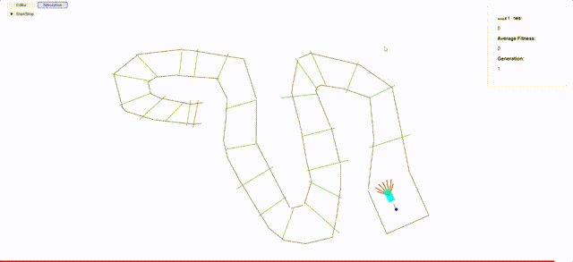

# smartcar
An interactive simulation of a population of cars learning to drive on a circuit using a genetic algorithm

The cars drive in a circuit formed by walls and a set of checkpoints (the green ones).
The fitness function is calculated by the number of checkpoint hitted and how much time the car takes to hit the goal.

Each generation has a limited time to live indicated by the bar at the bottom. 

## example
